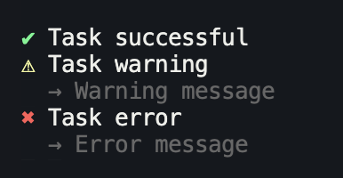

<p align="center">
    
    <br>
    <i>The minimal task runner for Node.js</i>
</p>

### Features
- Task list with dynamic states
- Parallel & nestable tasks
- Unopinionated
- Type-safe

→ [Try it out online](https://stackblitz.com/edit/tasuku-demo?file=index.js)

<sub>Support this project by starring and sharing it. [Follow me](https://github.com/privatenumber) to see what other cool projects I'm working on.</sub>

## Install
```sh
npm i tasuku
```

## About
タスク (Tasuku) is a minimal task runner for Node.js. You can use it to label any task/function so that its loading, success, and error states are rendered in the terminal.

For example, here's a simple script that copies a file from path A to B.

```ts
import task from 'tasuku'
import { copyFile } from 'fs/promises'

task('Copying file from path A to B', async ({ setTitle }) => {
	await copyFile('/path/A', '/path/B');

	setTitle('Successfully copied file from path A to B!')
})
```

Running the script will look like this in the terminal:


## Usage
### Task list
Call `task(taskTitle, taskFunction)` to start a task and display it in a task list in the terminal.

```ts
import task from 'tasuku'

task('Task 1', async () => {
    await someAsyncTask()
})

task('Task 2', async () => {
    await someAsyncTask()
})

task('Task 3', async () => {
    await someAsyncTask()
})
```


#### Task states
- **◽️ Pending** The task is queued and has not started
- **🔅 Loading** The task is running
- **⚠️ Warning** The task completed with a warning
- **❌ Error** The task exited with an error
- **✅ Success** The task completed without error



### Unopinionated
You can call `task()` from anywhere. There are no requirements. It is designed to be as unopinionated as possible not to interfere with your code.

The tasks will be displayed in the terminal in a consolidated list.

You can change the title of the task by calling `setTitle()`.
```ts
import task from 'tasuku'

task('Task 1', async () => {
    await someAsyncTask()
})

...

someOtherCode()

...

task('Task 2', async ({ setTitle }) => {
    await someAsyncTask()

    setTitle('Task 2 complete')
})
```


### Task return values
The return value of a task will be stored in the output `.result` property.

If using TypeScript, the type of `.result` will be inferred from the task function.

```ts
const myTask = await task('Task 2', async () => {
    await someAsyncTask()

    return 'Success'
})

console.log(myTask.result) // 'Success'
```

### Nesting tasks
Tasks can be nested indefinitely. Nested tasks will be stacked hierarchically in the task list.
```ts
await task('Do task', async ({ task }) => {
    await someAsyncTask()

    await task('Do another task', async ({ task }) => {
        await someAsyncTask()

        await task('And another', async () => {
            await someAsyncTask()
        })
    })
})
```


### Collapsing nested tasks
Call `.clear()` on the returned task API to collapse the nested task.
```ts
await task('Do task', async ({ task }) => {
    await someAsyncTask()

    const nestedTask = await task('Do another task', async ({ task }) => {
        await someAsyncTask()
    })

    nestedTask.clear()
})
```


### Grouped tasks
Tasks can be grouped with `task.group()`. Pass in a function that returns an array of tasks to run them sequentially.

This is useful for displaying a queue of tasks that have yet to run.

```ts
const groupedTasks = await task.group(task => [
    task('Task 1', async () => {
        await someAsyncTask()

        return 'one'
    }),

    task('Waiting for Task 1', async ({ setTitle }) => {
        setTitle('Task 2 running...')

        await someAsyncTask()

        setTitle('Task 2 complete')

        return 'two'
    }),

    ...
])

console.log(groupedTasks.results) // ['one', 'two']
```


### Running tasks in parallel
You can run tasks in parallel by passing in `{ concurrency: n }` as the second argument in `task.group()`.

```ts
const api = await task.group(task => [
    task(
        'Task 1',
        async () => await someAsyncTask(),
    ),
    
    task(
        'Task 2',
        async () => await someAsyncTask(),
    ),
    ...
], {
    concurrency: 2 // Number of tasks to run at a time
})

api.clear() // Clear output
```


Alternatively, you can also use the native `Promise.all()` if you prefer. The advantage of using `task.group()` is that you can limit concurrency, displays queued tasks as pending, and it returns an API to easily clear the results.

```ts
// No API
await Promise.all([
    task(
        'Task 1',
        async () => await someAsyncTask(),
    ),

    task(
        'Task 2',
        async () => await someAsyncTask(),
    ),
    ...
])
```

## API

### task(taskTitle, taskFunction)

Returns a Promise that resolves with object:
```ts
{
    // The result from taskFunction
    result: any,

    // Invoke to clear the results from the terminal
    clear: () => void,
}
```

#### taskTitle
Type: `string`

Required: true

The name of the task displayed.

#### taskFunction
Type:
```ts
({
    task: taskFunction,
    setTitle: (title: string) => void,
    setStatus: (status: string) => void,
    setOutput: (error: string | { message: string }) => void,
    setWarning: (warning: Error | string) => void,
    setError: (error: Error | string) => void,
}) => Promise<any>
```

Required: true

The task function. The return value will be stored in the `.result` property of the `task()` output object.


#### task
A task function to use for nesting.

#### setTitle()
Call with a string to change the task title.

#### setStatus()
Call with a string to set the status of the task. See image below.

#### setOutput()
Call with a string to set the output of the task. See image below.

#### setWarning()
Call with a string or Error instance to put the task in a warning state.

#### setError()
Call with a string or Error instance to put the task in an error state. Tasks automatically go into an error state when it catches an error in the task.


### task.group(createTaskFunctions, options)
Returns a Promise that resolves with object:
```ts
{
    // The results from the taskFunctions
    results: any[],

    // Invoke to clear the results from the terminal
    clear: () => void,
}
```

#### createTaskFunctions
Type: `(task) => Task[]`

Required: true

A function that returns all the tasks you want to group in an array.

#### options

Directly passed into [`p-map`](https://github.com/sindresorhus/p-map).

##### concurrency
Type: `number` (Integer)

Default: `1`

Number of tasks to run at a time.

##### stopOnError
Type: `boolean`

Default: `true`

When set to `false`, instead of stopping when a task fails, it will wait for all the tasks to finish and then reject with an aggregated error containing all the errors from the rejected promises.

## FAQ

### What does "Tasuku" mean?
_Tasuku_  or タスク is the phonetic Japanese pronounciation of the word "task".


### Why did you make this?

For writing scripts or CLI tools. _Tasuku_ is a great way to convey the state of the tasks that are running in your script without being imposing about the way you write your code.

Major shoutout to [listr](https://github.com/SamVerschueren/listr) + [listr2](https://github.com/cenk1cenk2/listr2) for being the motivation and visual inspiration for _Tasuku_, and for being my go-to task runner for a long time. I made _Tasuku_ because I eventually found that they were too structured and declarative for my needs.

Big thanks to [ink](https://github.com/vadimdemedes/ink) for doing all the heavy lifting for rendering interfaces in the terminal. Implementing a dynamic task list that doesn't interfere with `console.logs()` wouldn't have been so easy without it.

### Doesn't the usage of nested `task` functions violate ESLint's [no-shadow](https://eslint.org/docs/rules/no-shadow)?
Yes, but it should be fine as you don't need access to other `task` functions aside from the immediate one.

Put `task` in the allow list:
- `"no-shadow": ["error", { "allow": ["task"] }]`
- `"@typescript-eslint/no-shadow": ["error", { "allow": ["task"] }]`
