<p align="center">
    
    <br>
    <i>The minimal task runner for Node.js</i>
</p>

### Features
- Task list with dynamic states
- Parallel & nestable tasks
- Unopinionated
- Type-safe

→ [Try it out online](https://stackblitz.com/edit/tasuku-demo?file=index.js&devtoolsheight=50&view=editor)

<sub>Found this package useful? Show your support & appreciation by [sponsoring](https://github.com/sponsors/privatenumber)! ❤️</sub>

## Install
```sh
npm i tasuku
```

## About
タスク (Tasuku) is a minimal task runner for Node.js. You can use it to label any task/function so that its loading, success, and error states are rendered in the terminal.

For example, here's a simple script that copies a file from path A to B.

```ts
import { copyFile } from 'node:fs/promises'
import task from 'tasuku'

task('Copying file from path A to B', async ({ setTitle }) => {
    await copyFile('/path/A', '/path/B')

    setTitle('Successfully copied file from path A to B!')
})
```

Running the script will look like this in the terminal:

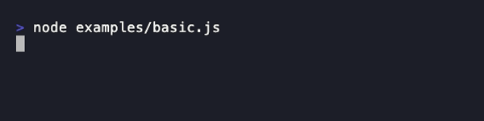

## Usage
### Task list
Call `task(taskTitle, taskFunction)` to start a task and display it in a task list in the terminal.

```ts
import task from 'tasuku'

task('Task 1', async () => {
    await someAsyncTask()
})

task('Task 2', async () => {
    await someAsyncTask()
})

task('Task 3', async () => {
    await someAsyncTask()
})
```

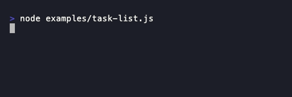

#### Task states
- **◽️ Pending** The task is queued and has not started
- **🔅 Loading** The task is running
- **⚠️ Warning** The task completed with a warning
- **❌ Error** The task exited with an error
- **✅ Success** The task completed without error

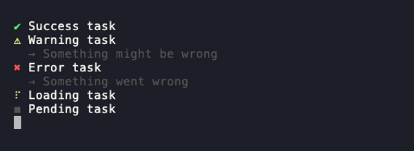

### Unopinionated
You can call `task()` from anywhere. There are no requirements. It is designed to be as unopinionated as possible not to interfere with your code.

The tasks will be displayed in the terminal in a consolidated list.

You can change the title of the task by calling `setTitle()`.
```ts
import task from 'tasuku'

task('Task 1', async () => {
    await someAsyncTask()
})

// ...

someOtherCode()

// ...

task('Task 2', async ({ setTitle }) => {
    await someAsyncTask()

    setTitle('Task 2 complete')
})
```

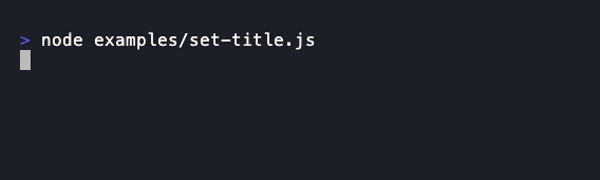

### Task return values
The return value of a task will be stored in the output `.result` property.

If using TypeScript, the type of `.result` will be inferred from the task function.

```ts
const myTask = await task('Task 2', async () => {
    await someAsyncTask()

    return 'Success'
})

console.log(myTask.result) // 'Success'
```

### Nesting tasks
Tasks can be nested indefinitely. Nested tasks will be stacked hierarchically in the task list.
```ts
await task('Do task', async ({ task }) => {
    await someAsyncTask()

    await task('Do another task', async ({ task }) => {
        await someAsyncTask()

        await task('And another', async () => {
            await someAsyncTask()
        })
    })
})
```

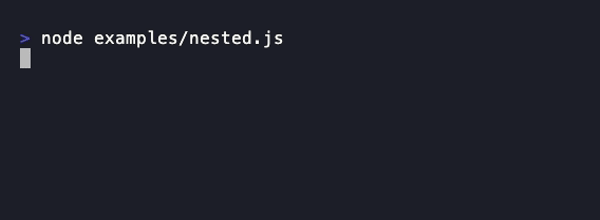

### Collapsing nested tasks
Call `.clear()` on the returned task API to collapse the nested task.
```ts
await task('Do task', async ({ task }) => {
    await someAsyncTask()

    const nestedTask = await task('Do another task', async ({ task }) => {
        await someAsyncTask()
    })

    nestedTask.clear()
})
```

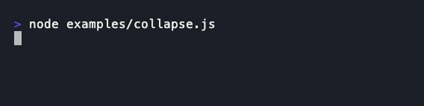

### Grouped tasks
Tasks can be grouped with `task.group()`. Pass in a function that returns an array of tasks to run them sequentially.

This is useful for displaying a queue of tasks that have yet to run.

```ts
const groupedTasks = await task.group(task => [
    task('Task 1', async () => {
        await someAsyncTask()

        return 'one'
    }),

    task('Waiting for Task 1', async ({ setTitle }) => {
        setTitle('Task 2 running...')

        await someAsyncTask()

        setTitle('Task 2 complete')

        return 'two'
    })

    // ...
])

console.log(groupedTasks) // [{ result: 'one' }, { result: 'two' }]
```

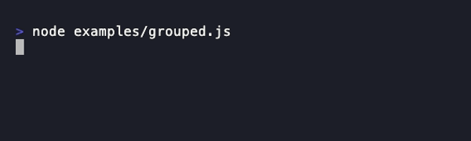

### Running tasks in parallel
You can run tasks in parallel by passing in `{ concurrency: n }` as the second argument in `task.group()`.

```ts
const api = await task.group(task => [
    task(
        'Task 1',
        async () => await someAsyncTask()
    ),

    task(
        'Task 2',
        async () => await someAsyncTask()
    )

    // ...
], {
    concurrency: 2 // Number of tasks to run at a time
})

api.clear() // Clear output
```

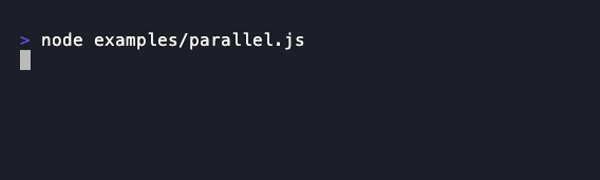

Alternatively, you can also use the native `Promise.all()` if you prefer. The advantage of using `task.group()` is that you can limit concurrency, displays queued tasks as pending, and it returns an API to easily clear the results.

```ts
// No API
await Promise.all([
    task(
        'Task 1',
        async () => await someAsyncTask()
    ),

    task(
        'Task 2',
        async () => await someAsyncTask()
    )

    // ...
])
```

## API

### task(taskTitle, taskFunction, options?)

Returns a Promise that resolves with object:
```ts
type TaskAPI = {
    // Result from taskFunction
    result: unknown

    // State of the task
    state: 'error' | 'warning' | 'success'

    // Warning message if state is 'warning', otherwise undefined
    warning: string | undefined

    // Error message if state is 'error', otherwise undefined
    error: string | undefined

    // Invoke to clear the results from the terminal
    clear: () => void
}
```

#### taskTitle
Type: `string`

Required: true

The name of the task displayed.

#### taskFunction
Type:
```ts
type TaskFunction = (taskInnerApi: {
    task: createTask
    setTitle(title: string): void
    setStatus(status?: string): void
    setOutput(output: string | { message: string }): void
    setWarning(warning?: Error | string | false | null): void
    setError(error?: Error | string | false | null): void
    streamPreview: Writable
    startTime(): void
    stopTime(): number
}) => Promise<unknown>
```

Required: true

The task function. The return value will be stored in the `.result` property of the `task()` output object.


#### task
A task function to use for nesting.

#### setTitle()
Call with a string to change the task title.

#### setStatus()
Call with a string to set the status of the task.

#### setOutput()
Call with a string to set the output of the task.

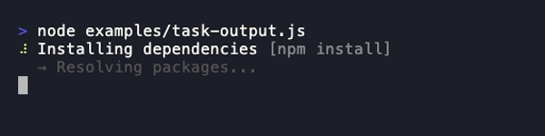

#### streamPreview
A `Writable` stream for displaying live output below the task. Pipe a child process or any readable stream into it to show a scrolling preview of the output.

Handles both `\n` (newline) and `\r` (carriage return) — programs like `curl` that use `\r` for in-place progress bars work out of the box.

```ts
import { spawn } from 'node:child_process'
import { pipeline } from 'node:stream/promises'

await task('Download', async ({ streamPreview }) => {
    const child = spawn('curl', ['-o', '/dev/null', 'https://example.com/file'])
    await pipeline(child.stderr, streamPreview)
})
```

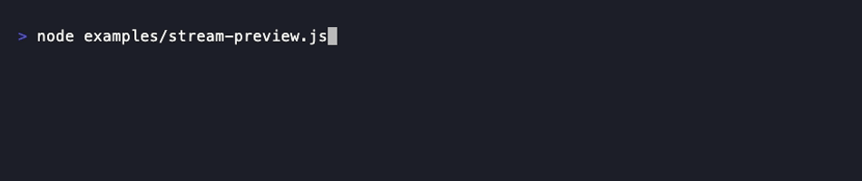

By default, shows the last 5 lines. Use the `previewLines` option to change this. When there are more lines than the limit, a `(+ N lines)` indicator is shown.

> [!NOTE]
> `setOutput()` and `streamPreview` render independently. If both are used, static output appears above the stream preview.

#### setWarning()
Call with a string or Error instance to put the task in a warning state. Call with no argument (or a falsy value) to revert to loading state.

#### setError()
Call with a string or Error instance to put the task in an error state. Call with no argument (or a falsy value) to revert to loading state. Tasks automatically go into an error state when it catches an error in the task.

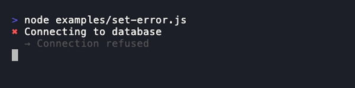

#### startTime()
Start or restart the elapsed time counter. Calling again resets to 0. Time is displayed after the status: `⠋ Task [status] (3s)`

#### stopTime()
Stop the elapsed time counter and return the elapsed milliseconds. The displayed time freezes at the stopped value. Useful for profiling task phases.

```ts
await task('Multi-phase', async ({ startTime, stopTime, setStatus }) => {
    startTime()
    await phase1()
    const phase1Time = stopTime()

    setStatus('phase 2')
    startTime()
    await phase2()
    const phase2Time = stopTime()

    console.log(`Phase 1: ${phase1Time}ms, Phase 2: ${phase2Time}ms`)
})
```

#### options
Type: `{ showTime?: boolean, previewLines?: number }`

Optional task options.

##### previewLines
Type: `number`

Default: `5`

Maximum number of lines to display in the `streamPreview` output (minimum 1). When the stream produces more lines, older lines scroll off and a `(+ N lines)` indicator shows the total.

##### showTime
When `true`, automatically starts the elapsed time counter when the task begins. Equivalent to calling `startTime()` at the start of the task function.

```ts
await task('Building', async () => {
    await build()
}, { showTime: true })
// Output: ✔ Building (3s)
```

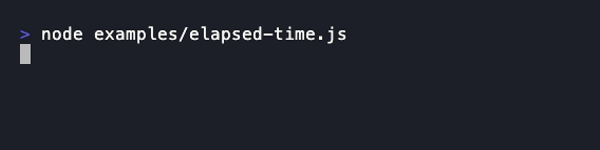

Time display:
- Format: `(Xs)` for under a minute, `(Xm Ys)` for under an hour, `(Xh Ym)` for longer
- Not shown if elapsed < 1 second
- Freezes at final value when task completes


### task.group(createTaskFunctions, options)
Returns a Promise that resolves with object:
```ts
// The results from the taskFunctions
type TaskGroupAPI = {
    // Result from taskFunction
    result: unknown

    // State of the task
    state: 'error' | 'warning' | 'success'

    // Invoke to clear the task result
    clear: () => void
}[] & {

    // Invoke to clear ALL results
    clear: () => void
}
```

#### createTaskFunctions
Type: `(task) => Task[]`

Required: true

A function that returns all the tasks you want to group in an array.

#### options

Directly passed into [`p-map`](https://github.com/sindresorhus/p-map).

##### concurrency
Type: `number` (Integer)

Default: `1`

Number of tasks to run at a time.

##### stopOnError
Type: `boolean`

Default: `true`

When set to `false`, instead of stopping when a task fails, it will wait for all the tasks to finish and then reject with an aggregated error containing all the errors from the rejected promises.

##### maxVisible

<p align="center">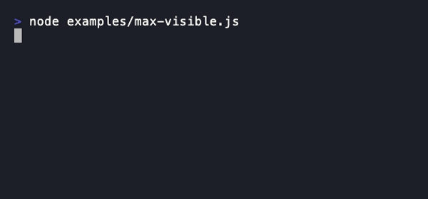</p>

Type: `number | ((terminalHeight: number) => number)`

Default: Responsive to terminal height (rows - 2, minimum 5)

Maximum number of lines to display in the task list. When there are more task lines than this limit, remaining tasks are hidden with a state breakdown (e.g., "(+ 3 loading, 5 queued, 4 completed)"). Active tasks are always prioritized over pending and completed ones. This accounts for nested subtasks which add extra lines.

Can be a fixed number or a function called on each render for responsive limits.

By default, the limit is automatically lifted when all tasks complete and `.clear()` is called, revealing the full list.

```ts
// Fixed limit
await task.group(task => [...tasks], {
    concurrency: 5,
    maxVisible: 10
})

// Responsive limit (terminal height passed as parameter)
await task.group(task => [...tasks], {
    concurrency: 5,
    maxVisible: height => height - 5
})
```

## FAQ

### What does "Tasuku" mean?
_Tasuku_  or タスク is the phonetic Japanese pronounciation of the word "task".


### Why did you make this?

I built _Tasuku_ as a lightweight task runner for scripts and CLI tools. It's designed to show task progress clearly without forcing a rigid structure on how you write your code.

Big thanks to [listr](https://github.com/SamVerschueren/listr) and [listr2](https://github.com/cenk1cenk2/listr2), which inspired both the visuals and the idea—I've relied on them for years. But over time, I found their declarative approach too restrictive for my workflow, so I created something simpler and more flexible.

_Tasuku_ uses its own minimal ANSI-based renderer for terminal output, giving you smooth `console.log()` integration with zero runtime dependencies. The rendering model was originally inspired by [ink](https://github.com/vadimdemedes/ink)'s approach to terminal UIs.

### Doesn't the usage of nested `task` functions violate ESLint's [no-shadow](https://eslint.org/docs/rules/no-shadow)?
Yes, but it should be fine as you don't need access to other `task` functions aside from the immediate one.

Put `task` in the allow list:
- `"no-shadow": ["error", { "allow": ["task"] }]`
- `"@typescript-eslint/no-shadow": ["error", { "allow": ["task"] }]`


## Sponsors
<p align="center">
	<a href="https://github.com/sponsors/privatenumber">
		
	</a>
</p>
