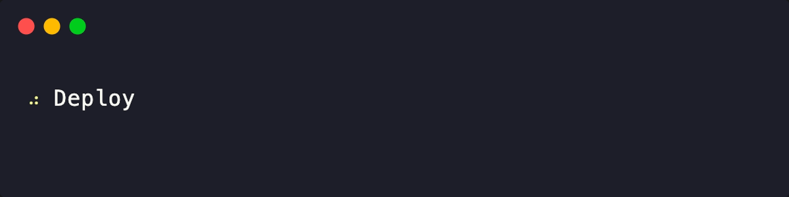
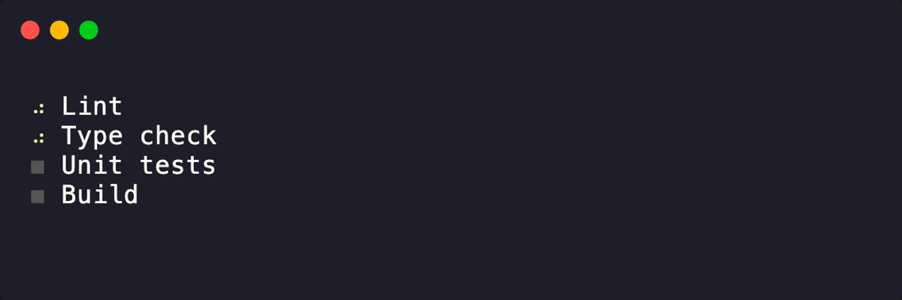
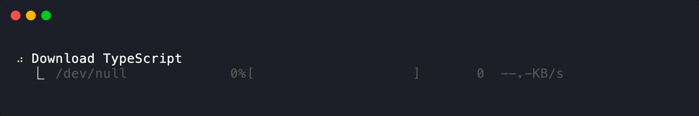
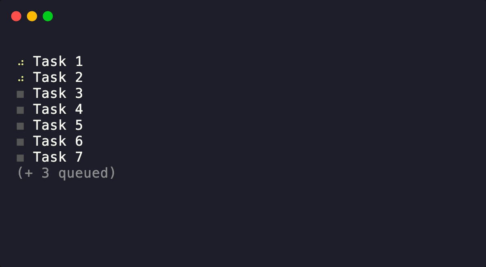
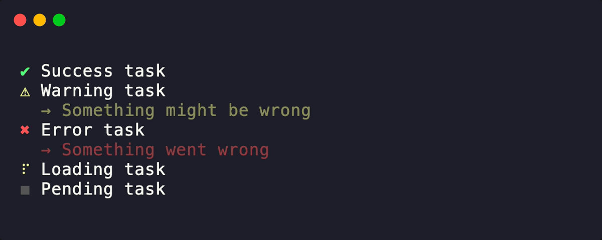
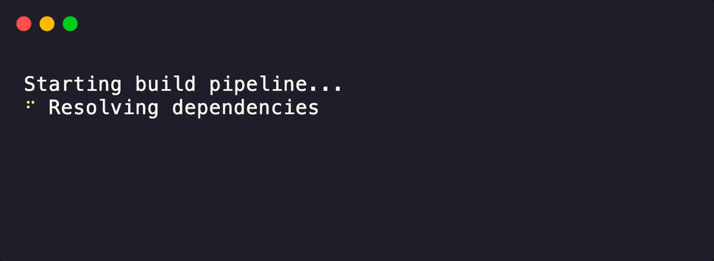
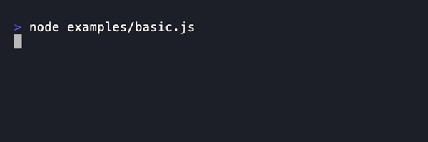
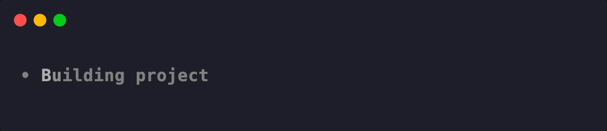

<p align="center" demo>


<!-- @vhs
Set Height 440
Hide
Type "node {file}"
Enter
Show
Sleep 5s
-->

<!--
```js
import { setTimeout } from 'node:timers/promises'
import task from 'tasuku'

await task.group(task => [
    task('Resolving dependencies', async ({ setTitle }) => {
        await setTimeout(1000)
        setTitle('Resolved 148 dependencies')
    }),
    task('Running tests', async ({ setTitle }) => {
        await setTimeout(1500)
        setTitle('42 tests passed')
    }),
    task('Building project', async ({ setTitle }) => {
        await setTimeout(1200)
        setTitle('Built in 1.2s')
    }),
])
```
-->
</p>

<h1 align="center">タスク</h1>
<p align="center">	
	<i>The minimalist's task runner for Node.js</i>
</p>


### Features
- Task list with dynamic states
- Parallel & nestable tasks
- Customizable themes (icons, colors, spinners)
- Two renderers: [pinned](#pinned-default) (animated) and [inline](#inline) (sequential)
- Zero runtime dependencies
- Renders to stderr — stdout stays clean for program output
- Type-safe

> [!TIP]
> [Try it out online](https://stackblitz.com/edit/tasuku-demo?file=index.js&devtoolsheight=50&view=editor)

## Install
```sh
npm i tasuku
```

## Quick start

タスク (Tasuku) is a minimal task runner for Node.js. Call `task()` from anywhere to display loading, success, and error states in the terminal:

```ts
import task from 'tasuku'

await task('Copying files', async () => {
    await copyFiles(source, destination)
})
```

Tasks can be grouped, nested, run in parallel, and cleared — all with a simple functional API. Read on for the full usage guide.

## Usage

### Nesting

Tasks can be nested indefinitely. Any `task()` call inside a task function automatically becomes a child task via async context tracking.

<p align="center" demo>

<details>
<summary>View code</summary>

<!-- @vhs
Set Height 440
Hide
Type "node {file}"
Enter
Show
Sleep 3s
-->

```js
import { setTimeout } from 'node:timers/promises'
import task from 'tasuku'

await task('Deploy', async () => {
    await setTimeout(1000)

    await task('Run migrations', async () => {
        await setTimeout(1000)

        await task('Seed database', async () => {
            await setTimeout(1000)
        })
    })
})
```

</details>
</p>

Since nesting is based on async context, task functions are composable across modules:
```ts
// db.ts
import task from 'tasuku'

export const migrate = (directory: string) => task('Running migrations', async () => {
    await runMigrations(directory)
})

export const seed = (count: number) => task('Seeding data', async () => {
    await seedDatabase(count)
})
```
```ts
// deploy.ts
import { migrate, seed } from './db.js'
import task from 'tasuku'

await task('Deploy', async () => {
    await migrate('./migrations') // automatically nested under "Deploy"
    await seed(1000)
})
```

### Collapsing

Call `.clear()` on the task promise to collapse the nested task. `.clear()` returns the promise, so you can chain it.

<p align="center" demo>

<details>
<summary>View code</summary>

<!-- @vhs
Set Height 300
Hide
Type "node {file}"
Enter
Show
Sleep 3s
-->

```js
import { setTimeout } from 'node:timers/promises'
import task from 'tasuku'

await task('Deploy', async () => {
    await setTimeout(500)

    // .clear() collapses the nested task on completion
    await task('Run migrations', async () => {
        await setTimeout(500)
    }).clear()
})
```

</details>
</p>

### task.group

Group tasks with `task.group()` to display a queue and control execution. Pass a function that returns an array of tasks. Set `concurrency` to run tasks in parallel — queued tasks show as pending until their turn.

<p align="center" demo>

<details>
<summary>View code</summary>

<!-- @vhs
Set Height 400
Hide
Type "node {file}"
Enter
Show
Sleep 5s
-->

```js
import { setTimeout } from 'node:timers/promises'
import task from 'tasuku'

await task.group(task => [
    task('Lint', async () => {
        await setTimeout(1000)
    }),
    task('Type check', async () => {
        await setTimeout(1500)
    }),
    task('Unit tests', async () => {
        await setTimeout(2000)
    }),
    task('Build', async () => {
        await setTimeout(2500)
    })
], { concurrency: 2 })
```

</details>
</p>

Alternatively, use `Promise.all()` if you prefer. The advantage of `task.group()` is concurrency control, pending state for queued tasks, and `.clear()` on the group promise.

## API

### task(title, taskFunction, options?)

Returns a `TaskPromise<T>` — a Promise that resolves to `T` (the task function's return value) with additional properties:
```ts
type TaskPromise<T> = Promise<T> & {
    // State of the task
    state: 'loading' | 'error' | 'warning' | 'success'

    // Warning message if state is 'warning', otherwise undefined
    warning: string | undefined

    // Error message if state is 'error', otherwise undefined
    error: string | undefined

    // Clear the task from the terminal. Returns the promise for chaining.
    // If the task is still running, clears automatically on completion.
    clear: () => TaskPromise<T>
}
```

The return value is the resolved value of the task function. If using TypeScript, the type is inferred:

```ts
const result = await task('Fetch data', async () => {
    const response = await fetch(apiUrl)
    return response.json()
})

console.log(result) // typed as the return value
```

### Task inner API

The task function receives an API object for controlling the task display:

```ts
type TaskFunction = (api: {
    signal: AbortSignal
    setTitle(title: string): void
    setStatus(status?: string): void
    setOutput(output: string | { message: string }): void
    setWarning(warning?: Error | string | false | null): void
    setError(error?: Error | string | false | null): void
    streamPreview: Writable & { clear(): void }
    startTime(): void
    stopTime(): number
}) => Promise<unknown>
```

#### signal

An `AbortSignal` that the task can use to respond to cancellation. The signal is cooperative — it only cancels work if you pass it to an API that respects it (like `fetch()`, streams, or `setTimeout` from `timers/promises`). Tasks that don't use the signal will continue running normally.

The signal is aborted automatically when:
- **In `task.group()`**: a sibling task fails (when `stopOnError` is `true`, the default)
- **In nested tasks**: the parent task throws an error

The error that caused the abort is available on `signal.reason`.

Many APIs like `fetch()` accept a signal and cancel automatically. For multi-step work, use `signal.throwIfAborted()` between steps to bail out early:

```ts
await task('Deploy', async ({ signal }) => {
    const artifact = await build({ signal })

    signal.throwIfAborted() // stop here if aborted during build

    await upload(artifact, { signal })

    signal.throwIfAborted() // stop here if aborted during upload

    await notifySlack('Deployed!')
})
```

##### Aborting by throwing

Throwing an error from a task aborts the signal for all child and sibling tasks:

```ts
// Nested tasks: parent throw aborts children
await task('Deploy', async () => {
    task('Upload assets', async ({ signal }) => {
        await upload(files, { signal })
    }).catch(() => {})

    throw new Error('deploy failed')
})

// Group tasks: sibling throw aborts siblings
await task.group(task => [
    task('Upload A', async ({ signal }) => {
        // signal.aborted becomes true when B fails, but only
        // cancels work if you pass it to an API that respects it
        await upload(fileA, { signal })
    }),
    task('Upload B', async () => {
        throw new Error('network error')
    })
], { concurrency: 2 })
```

##### Aborting with an external signal

Pass an `AbortController` signal via `options.signal` to cancel from outside:

```ts
// Nested tasks — abort after a timeout
await task('Deploy', async () => {
    await task('Long upload', async ({ signal }) => {
        await upload(files, { signal })
    }, { signal: AbortSignal.timeout(5000) })
})

// Group tasks — abort after a timeout
await task.group(task => [
    task('Upload A', async ({ signal }) => {
        await upload(fileA, { signal })
    }),
    task('Upload B', async ({ signal }) => {
        await upload(fileB, { signal })
    })
], { signal: AbortSignal.timeout(5000) })
```

#### setTitle()

Change the task title.

#### setStatus()

Set dimmed metadata after the title.

#### setOutput()

Set static output below the task.

#### streamPreview

A `Writable` stream for displaying live output below the task. Pipe a child process or any readable stream into it to show a scrolling preview.

Handles both `\n` (newline) and `\r` (carriage return) — programs like `wget` that use `\r` for in-place progress bars work out of the box.

<p align="center" demo>

<details>
<summary>View code</summary>

<!-- @vhs
Set Width 1790
Set Height 300
Hide
Type "node {file}"
Enter
Show
Sleep 5s
-->

```js
import { spawn } from 'node:child_process'
import { pipeline } from 'node:stream/promises'
import task from 'tasuku'

await task('Download TypeScript', async ({ setTitle, streamPreview }) => {
    const child = spawn('wget', [
        '-q',
        '--show-progress',
        '--progress=bar:force',
        '--limit-rate=2M',
        '-O',
        '/dev/null',
        'https://registry.npmjs.org/typescript/-/typescript-5.7.3.tgz'
    ])
    await pipeline(child.stderr, streamPreview)
    setTitle('Downloaded TypeScript')
})
```

</details>
</p>

By default, shows the last 5 lines. Use the `previewLines` option to change this. When there are more lines than the limit, a `(+ N lines)` indicator is shown.

Call `streamPreview.clear()` to remove the preview output. Useful for cleaning up verbose output after a task succeeds.

> [!NOTE]
> `setOutput()` and `streamPreview` render independently. If both are used, static output appears above the stream preview.

#### setWarning()

Call with a string or Error to put the task in a warning state. Call with no argument (or a falsy value) to revert to loading state.

#### setError()

Call with a string or Error to put the task in an error state. Call with no argument (or a falsy value) to revert to loading state. Tasks automatically enter error state when an uncaught error is thrown.

#### startTime()

Start or restart the elapsed time counter. Calling again resets to 0. Time is displayed after the status: `⠋ Task [status] (3s)`

#### stopTime()

Stop the elapsed time counter and return the elapsed milliseconds. The displayed time freezes at the stopped value.

```ts
await task('Multi-phase', async ({ startTime, stopTime, setStatus }) => {
    startTime()
    await phase1()
    const phase1Time = stopTime()

    setStatus('phase 2')
    startTime()
    await phase2()
    const phase2Time = stopTime()

    console.log(`Phase 1: ${phase1Time}ms, Phase 2: ${phase2Time}ms`)
})
```

Time format: `(Xs)` under a minute, `(Xm Ys)` under an hour, `(Xh Ym)` for longer. Not shown if elapsed < 1 second.

#### options

##### showTime

Type: `boolean`

Automatically start the elapsed time counter when the task begins. Equivalent to calling `startTime()` at the start of the task function.

##### previewLines

Type: `number`

Default: `5`

Maximum lines to display in `streamPreview` output (minimum 1). When the stream produces more lines, older lines scroll off and a `(+ N lines)` indicator shows the total.

##### signal

Type: `AbortSignal`

An external abort signal to cancel the task. The signal is exposed via the task inner API's `signal` property. When used in a group, the effective signal is a combination of both the external and group-internal signals.

```ts
task('Upload', async ({ signal }) => {
    await fetch(url, { signal })
}, { signal: AbortSignal.timeout(5000) })
```

### task.group(createTasks, options?)

Returns a `TaskGroupPromise` — a Promise that resolves to an array of return values with a `.clear()` method:
```ts
type TaskGroupPromise<Results> = Promise<Results> & {
    // Clear ALL task results from the terminal. Returns the promise for chaining.
    clear: () => TaskGroupPromise<Results>
}
```

#### createTasks

Type: `(task) => Task[]`

A function that returns all the tasks to group in an array.

#### options

##### concurrency

Type: `number`

Default: `1`

Number of tasks to run at a time.

##### stopOnError

Type: `boolean`

Default: `true`

When `false`, instead of stopping when a task fails, waits for all tasks to finish and rejects with an aggregated error.

##### signal

Type: `AbortSignal`

Abort signal to cancel pending tasks.

In addition to this external signal, `task.group()` creates an internal signal that auto-aborts all running tasks when one fails (when `stopOnError` is `true`, the default). This signal is passed to each task's inner API as `signal`, so task functions can react to sibling failures:

```ts
await task.group(task => [
    task('Upload A', async ({ signal }) => {
        await upload(fileA, { signal }) // aborted when B fails
    }),
    task('Upload B', async () => {
        throw new Error('network error') // triggers abort of A
    })
], { concurrency: 2 })
```

##### maxVisible

Type: `number | ((terminalHeight: number) => number)`

Default: Responsive to terminal height (rows - 2, minimum 5)

Maximum number of lines to display in the task list. When there are more task lines than this limit, remaining tasks are hidden with a state breakdown (e.g., "(+ 3 loading, 5 queued, 4 completed)"). Active tasks are always prioritized over pending and completed ones.

Can be a fixed number or a function called on each render for responsive limits. By default, the limit is automatically lifted when all tasks complete and `.clear()` is called.

<p align="center" demo>

<details>
<summary>View code</summary>

<!-- @vhs
Set Height 660
Hide
Type "node {file}"
Enter
Show
Sleep 8s
-->

```js
import { setTimeout } from 'node:timers/promises'
import task from 'tasuku'

await task.group(
    task => Array.from(
        { length: 10 },
        (_, i) => task(
            `Task ${i + 1}`,
            () => setTimeout(500 + Math.random() * 1200)
        )
    ),
    {
        concurrency: 2,
        maxVisible: 8
    }
)
```

</details>
</p>

### Task anatomy

<p align="center" demo>

<details>
<summary>View code</summary>

<!-- @vhs
Set Height 340
Hide
Type "node {file}"
Enter
Show
Sleep 7s
-->

```js
import { setTimeout } from 'node:timers/promises'
import task from 'tasuku'

await task('my title', async ({ setTitle, setStatus, setOutput }) => {
    await setTimeout(1000)

    setStatus('my status')
    await setTimeout(1500)

    setOutput('my output')
    await setTimeout(1500)

    setTitle('updated title')
    await setTimeout(1000)
})
```

</details>
</p>

#### Task states

| State | Icon | Description |
| :--- | :---: | :--- |
| Pending | ◼ | Queued, not yet started |
| Loading | ⠋ | Running (animated spinner) |
| Success | ✔ | Completed without error |
| Warning | ⚠ | Completed with a warning |
| Error | ✖ | Exited with an error |

<p align="center" demo>

<details>
<summary>View code</summary>

<!-- @vhs
Set Height 480
Set TypingSpeed 0
Hide
Type "node {file}"
Enter
Sleep 800ms
Show
Sleep 3s
-->

```js
import { setTimeout } from 'node:timers/promises'
import task from 'tasuku'

const tasks = task.group(task => [
    task('Success task', async () => {
        await setTimeout(100)
    }),

    task('Warning task', async ({ setWarning }) => {
        await setTimeout(100)
        setWarning('Something might be wrong')
    }),

    task('Error task', async ({ setError }) => {
        await setTimeout(100)
        setError(new Error('Something went wrong'))
    }),

    task('Loading task', async () => {
        await setTimeout(5000)
    }),

    task('Pending task', async () => {
        await setTimeout(100)
    })
], {
    concurrency: 1,
    maxVisible: 10
})
await tasks

tasks.clear()
```

</details>
</p>

## Renderers

Tasuku ships two renderers that control how task output appears in the terminal. The default export uses `pinned`, but you can switch to `inline` via `createTasuku`.

### Pinned (default)

The pinned renderer keeps the task list fixed at the bottom of the terminal using cursor save/restore. Spinner animations update in-place, and `console.log` output is moved above the task area. This is the default behavior.

### Inline

The inline renderer writes output sequentially — each task result is appended as a new line, and `console.log` output appears exactly where it was called, interleaved with task results.

Use this when:
- You want `console.log` and task output in natural order ([#16](https://github.com/privatenumber/tasuku/issues/16))
- You're logging to a file or piping output
- You want minimal terminal manipulation

<p align="center" demo>

<details>
<summary>View code</summary>

<!-- @vhs
Set Height 440
Hide
Type "node {file}"
Enter
Show
Sleep 7s
-->

```js
import { setTimeout } from 'node:timers/promises'
import { createTasuku, inline, theme } from 'tasuku'

const task = createTasuku({
    renderer: inline,
    theme
})

console.log('Starting build pipeline...')

await task('Resolving dependencies', async ({ setTitle }) => {
    await setTimeout(1500)
    setTitle('Resolved 148 dependencies')
})

console.log('Dependencies locked ✓')

await task('Running tests', async ({ setTitle }) => {
    await setTimeout(2000)
    setTitle('42 tests passed')
})

console.log('All checks passed — ready to deploy')
```

</details>
</p>

On TTY, the inline renderer tracks each task line by its offset from the cursor and updates it in-place using `CSI n A` (cursor up) and `CSI n B` (cursor down). On non-TTY (piped output, CI), only the final state is written — no spinner frames or cursor sequences.

> [!NOTE]
> The inline renderer does not support `maxVisible` since tasks are written to scrollback immediately.

> [!IMPORTANT]
> `CSI n A` clamps at row 1 of the visible viewport — it cannot enter the scrollback buffer. Tasks that scroll above the visible terminal window can no longer be updated in-place. This is a terminal limitation, not a software one. If you have more concurrent tasks than terminal rows, consider using the [pinned](#pinned-default) renderer instead.

## Themes

### Default

The built-in theme with braille spinner and standard terminal colors.

<p align="center" demo>

<details>
<summary>View code</summary>

<!-- @vhs
Set Height 260
Hide
Type "node {file}"
Enter
Show
Sleep 6s
-->

```js
import { setTimeout } from 'node:timers/promises'
import task from 'tasuku'

await task('Building project', async ({ setTitle }) => {
    await setTimeout(3000)
    setTitle('Build complete')
})
```

</details>
</p>

### Claude

Claude Code-inspired theme with truecolor palette, dingbat star spinner, and shimmer title animation. Import from `tasuku/claude`.

<p align="center" demo>

<details>
<summary>View code</summary>

<!-- @vhs
Set Height 260
Hide
Type "node {file}"
Enter
Show
Sleep 6s
-->

```js
import { setTimeout } from 'node:timers/promises'
import task from 'tasuku/claude'

await task('Building project', async ({ setTitle }) => {
    await setTimeout(5000)
    setTitle('Build complete')
})
```

</details>
</p>

### Blink

Reduced-motion theme inspired by Claude Code's accessibility mode. The `⏺` indicator pulses between bright and dim on a 2-second cycle. Import from `tasuku/blink`.

<p align="center" demo>

<details>
<summary>View code</summary>

<!-- @vhs
Set Height 260
Hide
Type "node {file}"
Enter
Show
Sleep 6s
-->

```js
import { setTimeout } from 'node:timers/promises'
import task from 'tasuku/blink'

await task('Building project', async ({ setTitle }) => {
    await setTimeout(5000)
    setTitle('Build complete')
})
```

</details>
</p>

### Codex

OpenAI Codex CLI-inspired theme with cosine-based shimmer gradient and monochrome palette. Import from `tasuku/codex`.

<p align="center" demo>

<details>
<summary>View code</summary>

<!-- @vhs
Set Height 260
Hide
Type "node {file}"
Enter
Show
Sleep 6s
-->

```js
import { setTimeout } from 'node:timers/promises'
import task from 'tasuku/codex'

await task('Building project', async ({ setTitle }) => {
    await setTimeout(5000)
    setTitle('Build complete')
})
```

</details>
</p>

### Custom themes

Create your own theme with `createTasuku()`. Each call returns an independent task runner with its own renderer.

Every theme entry point exports `createTasuku` and `theme`, so you can use any built-in theme as a base. Import renderers from the main `'tasuku'` entry point:

```ts
import { rgb } from 'ansis'
import { createTasuku, pinned, theme } from 'tasuku'

const frames = ['⠋', '⠙', '⠹', '⠸', '⠼', '⠴', '⠦', '⠧', '⠇', '⠏']
const rainbow = frames.map((frame, i) => {
    const hue = (i / frames.length) * 360
    const [r, g, b] = hslToRgb(hue, 100, 50)
    return rgb(r, g, b)(frame)
})

const task = createTasuku({
    renderer: pinned,
    theme: {
        ...theme,
        spinner: rainbow
    }
})

await task('Custom task', async () => {
    await someAsyncTask()
})
```

#### Theme object

```ts
type TasukuTheme = {
    spinner: string[] // Pre-colored spinner frames
    spinnerInterval?: number // ms between frames (default: 80)
    icons: {
        pending: string // Pre-colored icon strings
        success: string
        error: string
        warning: string
        parent: string // Parent task with children
        parentError: string // Parent task in error state
    }
    colors: {
        title?: (text: string, state: State, frame: number) => string
        dim: (text: string) => string // Status, elapsed time
        secondary: (text: string) => string // Output text, stream preview
    }
}
```

The `title` color function receives the task state and animation frame counter, enabling per-frame effects like shimmer animations.

#### renderer

Type: `RendererFactory`

Required. The [renderer](#renderers) to use. Import `pinned` or `inline` from any entry point.

#### outputStream

Type: `NodeJS.WriteStream`

Default: `process.stderr`

The stream to render task UI to. Defaults to stderr so that stdout stays clean for program output (e.g. `mytool | jq`). `console.log` output goes to stdout unaffected.

### Contributing a theme

Have a theme you're proud of? We'd love to see it. Open a PR to add it as a built-in theme.

We hold themes to a high design standard — they should be elegant, versatile, and visually cohesive across all task states. We may decline themes that don't meet this bar, so don't take it personally.

## Sponsors
<p align="center">
	<a href="https://github.com/sponsors/privatenumber">
		
	</a>
</p>
